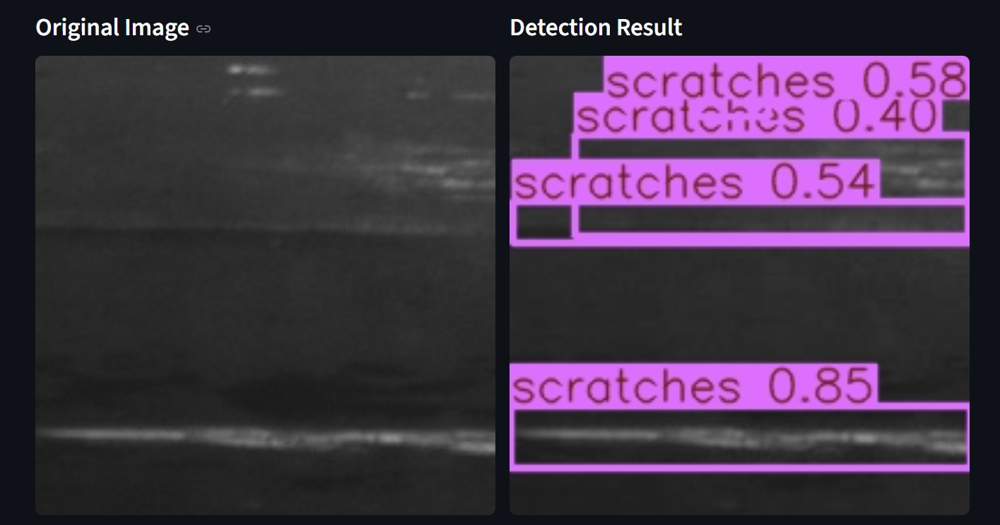
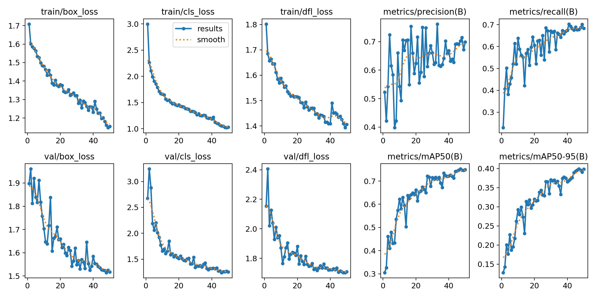

# Steel Surface Defect Detection using YOLO

A Computer Vision project for detecting and classifying steel surface defects using YOLO and Streamlit. The system identifies defects on steel surfaces and provides real-time predictions through an interactive web application.

## Project Overview

This project was developed using the NEU Surface Defect Database and trained using YOLO for object detection. A Streamlit web interface was built to allow users to upload steel surface images and visualize detection results instantly.

## Defect Classes

The model detects the following six defect types:

* Crazing
* Inclusion
* Patches
* Pitted Surface
* Rolled-in Scale
* Scratches

## Model Performance

| Metric        | Score |
| ------------- | ----- |
| mAP@0.5       | 0.753 |
| Precision     | 0.70  |
| Recall        | 0.68  |
| Best F1 Score | 0.67  |

## Technologies Used

* Python
* YOLO (Ultralytics)
* PyTorch
* OpenCV
* Streamlit
* NumPy

## Project Structure

```text
.
├── app.py
├── models/
│   └── best.pt
├── Screenshots/
├── visualization/
├── requirements.txt
└── README.md
```

## Installation

```bash
pip install -r requirements.txt
```

## Run the Application

```bash
streamlit run app.py
```

## Application Interface

Add screenshots from the `Screenshots` folder here.

## Training Results

Training visualizations and evaluation metrics are available in the `visualization` directory.

## Author

**Beshoy Nagy**

GitHub: https://github.com/Beshoy-Nagy
## Application Interface


## Sample Detection



## Results


